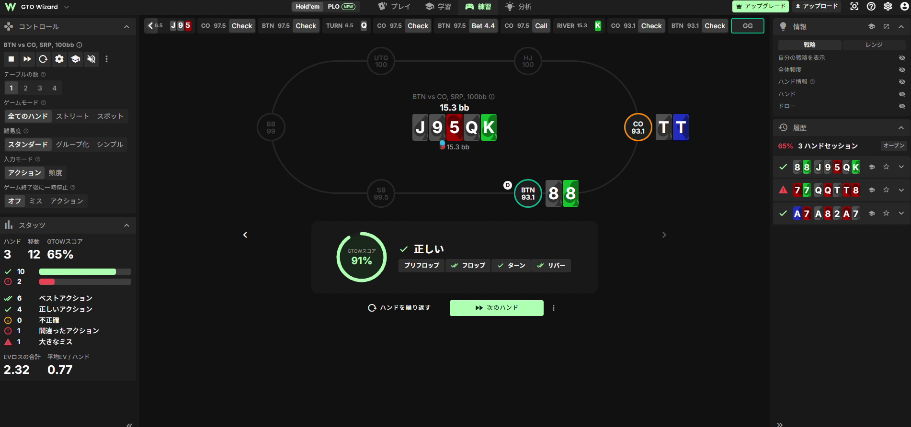
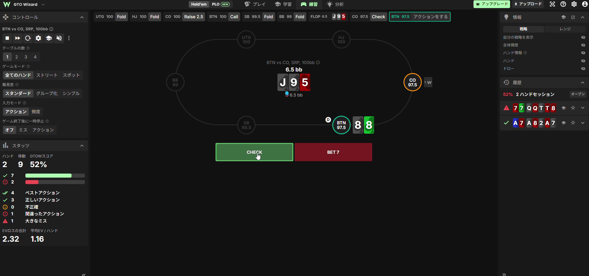
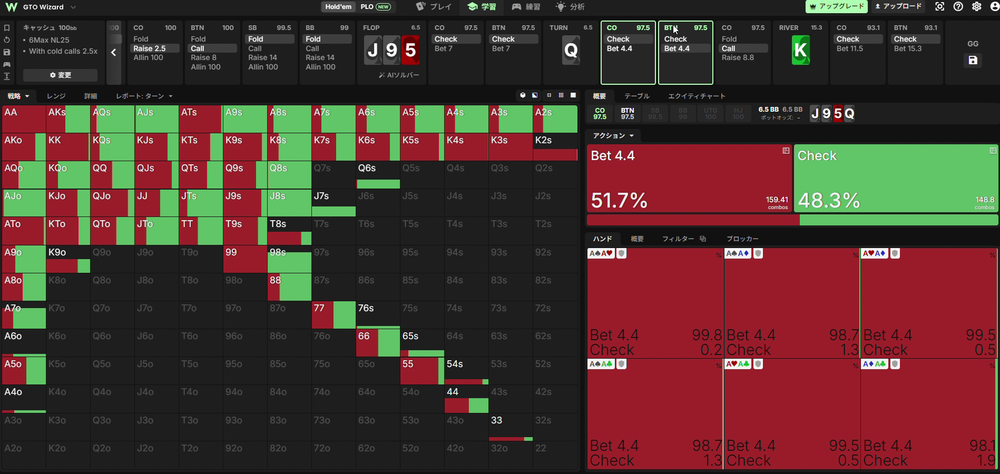
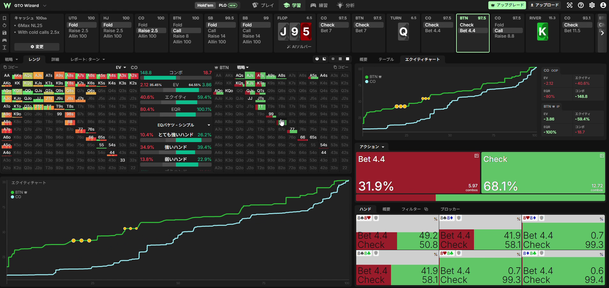
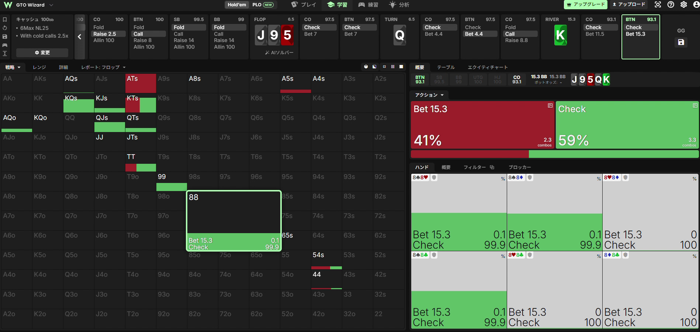
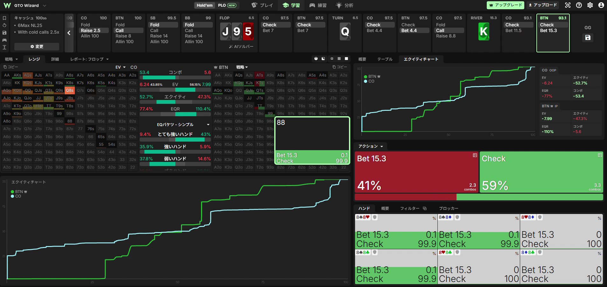

# ハンドレビュー：BTN 88 vs CO — J♠9♠5♥ Q♠ K♣ を「切り離し・押し上げ」で読む

> GTO Wizard の1ハンドを題材に、**リバーでミドルペアをチェックする理由**を、
> [Amu(goole) ポーカー知識ノート](./amu-goole-poker-notes.md) の理論
> （[EQの切り離しと押し上げ](./amu-goole-poker-notes.md#ポストフロップとriver) /
> [ポラライズ](./amu-goole-poker-notes.md#レンジ構造とベットサイズ理論) /
> [bet sizeの第一歩](./amu-goole-poker-notes.md#レンジ構造とベットサイズ理論)）
> で説明する解説記事です。数値・画像は GTO Wizard のソリューションから引用しています（非公式の学習用まとめ）。

---

## この記事の結論（先に一言）

> **リバーで 88 は「ベットしても意味がない・ブラフにも使えない」中間ハンドなので、チェックが最大EV。**
> レンジEQが5割前後あっても、**打てるのはポラー（バリュー＋ブラフ）だけ**で、ミドルは谷に落ちる。
> これが「レンジEQがあるだけでは戦略は決まらない」＝**切り離しと押し上げ**の実例です。

---

## ハンドの全体像

**フォーマット**: 6max NL25 キャッシュ / 100bb / **BTN vs CO のSRP（シングルレイズポット）**
**プリフロップ**: CO が 2.5bb オープン → **あなた（BTN）が 8♠8♣ でコール**。ヘッズアップ。

| ストリート | ボード | pot(bb) | CO（PFR, OOP） | あなた（BTN, IP） | 結果 |
|---|---|---|---|---|---|
| フロップ | J♠ 9♠ 5♥ | 6.5 | Check | **Check**（88でチェックバック） | check / check |
| ターン | + Q♠（スペード3枚・モノトーン） | 6.5 | Check | **Bet 4.4**（≈68% pot） | CO **Call** |
| リバー | + K♣（スペード来ず） | 15.3 | Check | **Check**（88でチェックバック） | ショウダウン |

最終盤面は **J-9-5-Q-K**。88 も相手の TT も「役なしのポケットペア」で、**TT > 88 なのでポットは負け**。
しかし GTOWスコアは **91%＝正しい**（全ストリート正解）。**負けたがプレーは完璧**、というのがこのハンドの主題です。

---

## フロップ J♠9♠5♥ — 88はチェックバック

CO（本来の攻め手）がフロップを**チェックして主導権を放棄**。あなたはIPで自由に打てますが、
**88（9・Jに負けるアンダーペア＝実質サードペア）はベットしても得がありません**。

- 打つと、**勝っている手（COのトラッシュ）は全部降り**、**負けている手（9ヒット・Jヒット・オーバーペア）だけがコール**してくる。
  → [bet sizeの第一歩](./amu-goole-poker-notes.md#レンジ構造とベットサイズ理論) の
  **「Value bet は相手の *callレンジ* に勝って初めて成立」** の逆で、打つ価値がない。
- 88には多少のショウダウンバリューがあるので、**チェックでポットコントロール**。
- J高の Broadway 絡みボードは、CO のオープンレンジ相手に BTN 側が大きなナッツ優位を持たないため、
  BTNレンジ全体でもチェックバックが多いボード。

---

## ターン Q — ここは Bet 4.4（≈68% pot）

ターンでCOがまたチェック。ここで **BTNはレンジの約半分でベット**します。

- ソルバーの全体頻度: **Bet 4.4 = 51.7% / Check = 48.3%**。
- このときの **BTNレンジEQは約59.4%**（下図エクイティチャートで緑=BTNが青=COの上に来ている）。
  レンジ優位があるので、ややバリュー寄りに打てるスポット。

88単体は**混合**、しかも**スート依存**でした（ブロッカー効果）。

- 8**♠** を持つ **8♠8♣ → Bet ≈49% / Check ≈51%**
- スペードを持たない **8♥8♦ → Bet 0.7% / Check 99%**

ターン Q♠ で盤面は**スペード3枚（モノトーン）**。あなたの手は **8♠8♣＝スペードのブロッカー持ち**なので、**Bet 4.4 は正解の側**。
狙いは **ブロッカー＋Protection（8♠が相手の完成フラッシュ／フラッシュドローのコンボを減らし、オーバーカードのEQも否定）＋ポット形成**。スペードを持たない88がほぼ100%チェックなのと対照的。
[ノートの通り](./amu-goole-poker-notes.md#レンジ構造とベットサイズ理論)、
**ターンにはまだ引くカードが残るので Protection の価値がある**——これがフロップやリバーと違う点です。

---

## リバー K — 88はチェック（★核心）

リバー K♣ で盤面は **J♠-9♠-5♥-Q♠-K♣**（スペードは増えず）。ターンで出来た**スペードのフラッシュがナッツ級**で、
さらに **T があれば 9-T-J-Q-K、A があれば T-J-Q-K-A のストレートも完成する**、役の入りやすいボードです。CO がチェック。正解は **チェックバック**。

- ソルバーの全体頻度: **Bet 15.3（＝ポット100%のポラー・サイズ）= 41% / Check = 59%**。
- そして **88 は Bet 0.1% / Check 99.9%＝ほぼ純チェック**。

なぜ、レンジの41%も打つスポットで 88 は打たないのか。理由は4つです。

### ① リバーのベットは「ポラー（二極）」— 88は真ん中だから打てない
BTNが打つ 15.3 は **ポット100%＝ポラー・サイズ**。中身は
**バリュー（AT・KT・QT などのストレート、セット/強い2ペア）＋ ブラフ（完全に外したエア）**。
88 は**その真ん中（ミドル）**で、[ポラライズ](./amu-goole-poker-notes.md#レンジ構造とベットサイズ理論)
で言う *linear でも polar でもない中間帯*。**ベットレンジに入れる資格がない**。

### ② 「切り離し」— 88のcallレンジに対する真のEQは低い
88 は CO の**レンジ全体**にはそこそこ勝っていそうに見える。だが、リバーでポット大の
**ベットにコールしてくるレンジ**（＝ストレート・Q以上のペア・強い2ペア）だけを **切り離して** 見ると、
**88はほぼ全部に負けている**。→ **Value bet 不成立**（打っても「勝っている手は降り、負けている手がコール」）。

### ③ 「押し上げ」の裏返し — でもブラフにもできない
一方、CO がチェックで回してくる**降ろされ組（ミスった手・弱いエア）**には 88 は勝っている。
つまり 88 には **ショウダウンバリューがある**。ブラフに使うとその価値を捨てることになる。
→ **バリューでも打てず、ブラフにも回せない → チェックしてSD勝負が最大EV**。これがミドルハンドの定位置（バリューとブラフの“谷”）。

### ④ リバーには Protection が無い
ターンで 88 を打てたのは「まだカードが残る＝Protectionがある」から。リバーは**残りカードが無く Protection 価値ゼロ**。
[ノートの *「Riverには Protection がないので Value/Bluff を厳密に判断する」*](./amu-goole-poker-notes.md#レンジ構造とベットサイズ理論)
がそのまま当てはまり、**曖昧な理由で打つ動機が消える** → チェック。

---

## 数字の読み方（EQ ≠ EV ≠ EQR）

下のリバー画面（BTN=IP側の値）が、ノートの
[EVとEQ](./amu-goole-poker-notes.md#evとeq期待値とエクイティ) /
[切り離しと押し上げ](./amu-goole-poker-notes.md#ポストフロップとriver) を数値で見せてくれます。

| 指標 | リバーでのBTN | 意味 |
|---|---|---|
| **エクイティ(EQ)** | **≈47.3%**（CO ≈52.7%） | 生の勝率はむしろCOにわずかに負けている |
| **EV** | **≈56.2%** | なのに獲得期待値はBTNが上 |
| **EQR（実現率）** | **≈110%**（CO ≈77%） | BTNは持っているEQ以上を“実現”、COは実現しきれない |

**生EQが5割を切っていてもBTNのEVが上回る**——これは **IP＋ポラライズで相手のブラフキャッチャーを苦しめられる**から。
ノートの *「レンジEQがあるだけでは戦略は決まらない。EQR（実現率）を加味した“正味EQ”で捉えよ」* の実例そのもので、
**「EQがあるからベット」ではなく「打てるハンドだけがベット、88はチェック」** に落ち着きます。

---

## まとめ・実戦チェックリスト

- [ ] **リバーでミドルハンドは基本チェック**。「そこそこ強い＝打つ」ではない。
- [ ] **打つ資格があるのは 2種類だけ**：大きいサイズにコールされても勝てる**バリュー**と、SD価値の無い**ブラフ**。88はどちらでもない。
- [ ] **Value か否かは “相手のcallレンジ” で判断**（bet sizeの第一歩）。88 は callレンジに負けているので打てない。
- [ ] **同じ88でもストリートで扱いが逆**：フロップ/ターンは Protection・EQ否定で打てる、**リバーは Protection が消えるので打てない**。
- [ ] **ブロッカーで頻度が変わる**（ターンの 8♠ 有無で Bet 49% vs 0.7%）。手札のスートまで見て混合頻度を決める。
- [ ] **結果と正誤を分ける**（[思考をハンドレビューする](./amu-goole-poker-notes.md#学習法思考をハンドレビューする)）。
  このハンドは **TTに負けたが 91%＝正解**。レビュー対象は「88をリバーでチェックした判断」であり、負けたこと自体ではない。

---

*出典: GTO Wizard のソリューション画面（6max NL25, 100bb, BTN vs CO SRP）。理論の枠組みは
note.com「Amu(goole)」の無料記事に基づく（本記事は非公式の学習用まとめ）。数値・頻度はソルバー出力の読み取りであり、
最終判断は公式の出力とクロスチェックしてください。*
